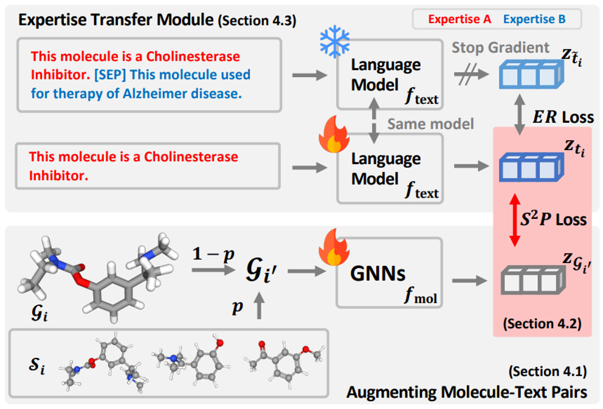
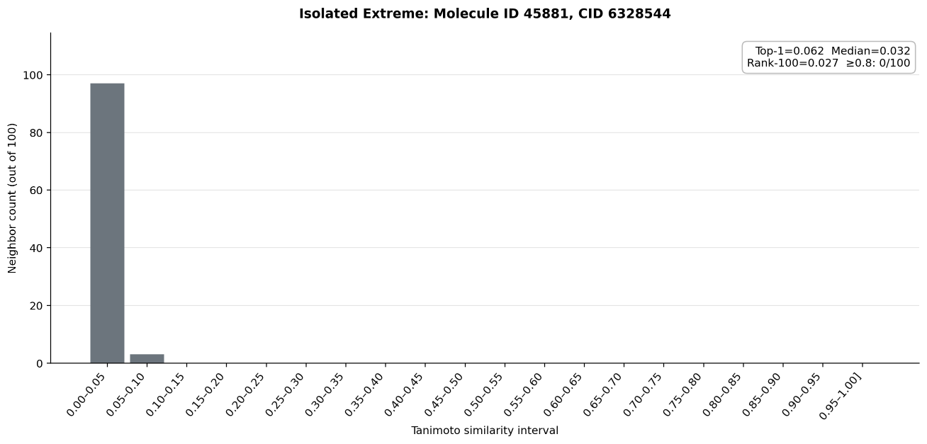
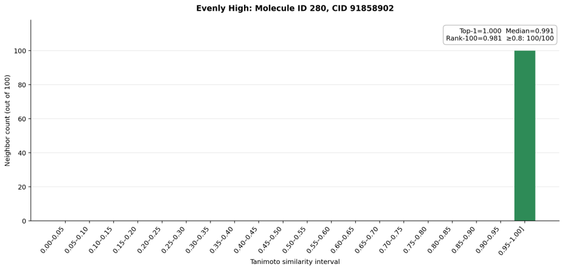
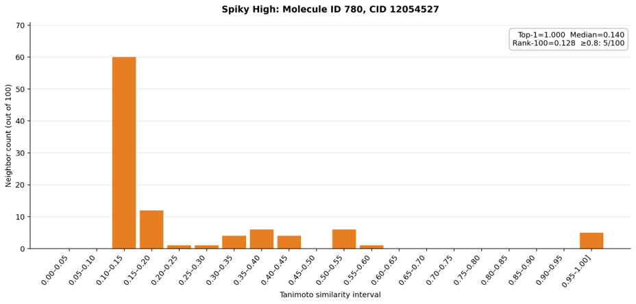
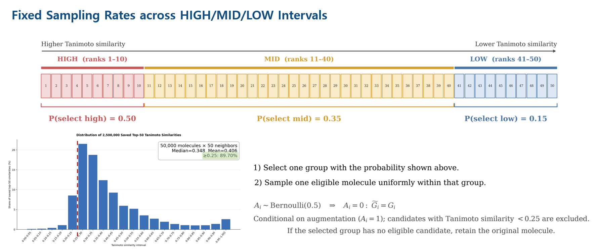
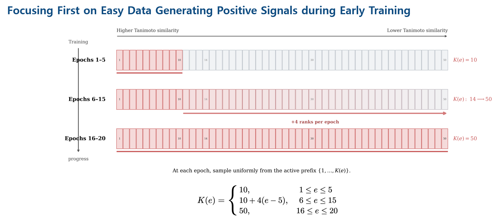
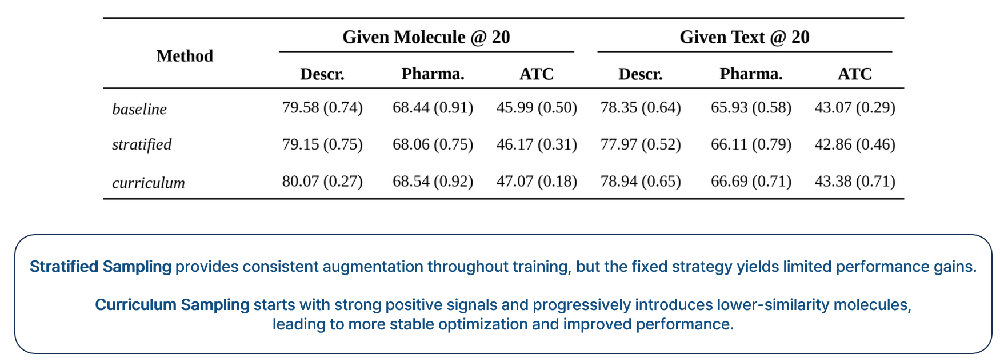
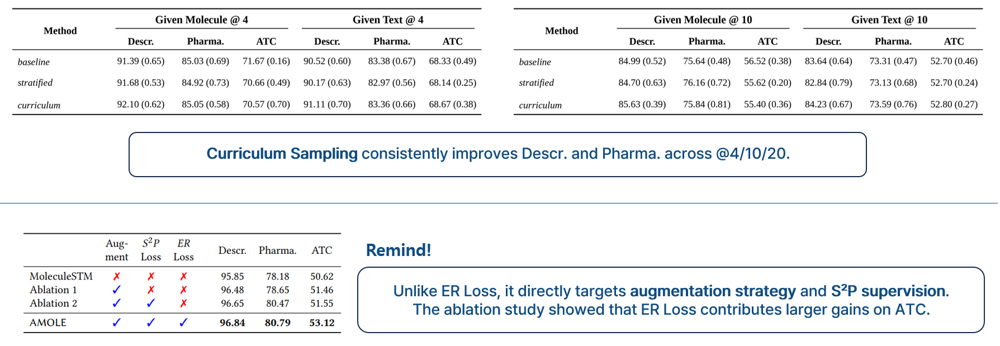
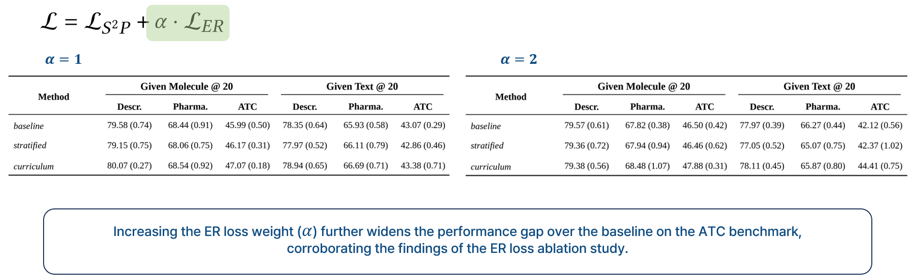

# Structural Similarity-Guided Contrastive Curriculum Learning for Molecule–Text Alignment


This project starts from
[AMOLE](https://github.com/Namkyeong/AMOLE), which aligns molecular graphs and
biomedical text through structure-aware contrastive learning and expertise
transfer. The central question of this repository is:

> Can an easy-to-hard curriculum provide more reliable structural supervision
> than uniformly sampling from a fixed top-*k* molecular neighborhood?

The reproduction compares the original uniform top-50 policy with two
alternatives: fixed similarity-stratified sampling and an epoch-dependent
curriculum that gradually expands from highly similar to less similar
molecules.


## Background: AMOLE

Molecule–text pretraining is constrained by two recurring problems:

1. high-quality molecule–description pairs are limited; and
2. different textual descriptions contain uneven or incomplete domain
   knowledge.

AMOLE addresses them with two complementary objectives.


### Molecule–text pair augmentation

For an original molecule–text pair $(G_i, t_i)$, AMOLE retrieves a top-*k*
set of structurally similar molecules. Let $\mathcal{S}_i$ denote the ordered
candidate set:

```math
\mathcal{S}_i = \{G_{i,1}, G_{i,2}, \ldots, G_{i,k}\},
\qquad
s(G_i,G_{i,1}) \ge \cdots \ge s(G_i,G_{i,k}),
```

where $s(\cdot,\cdot)$ is Morgan-fingerprint Tanimoto similarity. With
replacement probability $p_{\mathrm{aug}}$, a molecule $G_i'$ is sampled from
$\mathcal{S}_i$ and paired with the original text $t_i$.
The original AMOLE policy samples uniformly from a fixed top-*k* set.

### Structural Similarity Preserving loss

The Structural Similarity Preserving (S²P) loss uses Tanimoto similarity
between molecular fingerprints as a soft contrastive target. Cross-modal
embedding similarities are trained to follow this structural target in both
text-to-molecule and molecule-to-text directions.

Unlike one-hot contrastive supervision, S²P preserves graded relationships:
closely related molecules receive stronger positive supervision, while less
related molecules receive weaker supervision.

### Expertise Reconstruction loss

The Expertise Reconstruction (ER) loss transfers information between multiple
descriptions associated with molecular expertise. Its contribution is
controlled by $\alpha$:

```math
\mathcal{L}
=
\mathcal{L}_{S^2P}
+
\alpha \mathcal{L}_{ER}.
```

S²P primarily governs structural alignment and augmentation quality, whereas
ER focuses on textual expertise transfer.


## Motivation

AMOLE assumes that uniform sampling from the top-*k* Tanimoto neighbors
provides useful augmented positives. My own analysis showed that the actual
neighborhood geometry can differ substantially across molecules.

### 1. A fixed top-*k* set does not guarantee consistent positive quality

Different molecules may have qualitatively different neighborhoods:


- **low-similarity neighborhoods:** even the nearest candidates may be weak
  semantic positives.


- **near-duplicate neighborhoods:** extremely similar candidates provide
  little structural diversity.


- **skewed or spiky neighborhoods:** a small number of highly informative
  candidates coexist with many lower-similarity candidates.

Consequently, the same value of *k* can represent very different levels of
augmentation difficulty.

### 2. Uniform sampling ignores rare but informative neighbors

When lower-similarity molecules dominate a top-*k* set, uniform sampling can
under-sample the few strong positives. This weakens the structural signal used
to construct the S²P soft labels.

### 3. Augmentation difficulty should change during training

Early optimization benefits from clear positive signals. Introducing ambiguous
or weakly related molecules too early can make the structural target noisy
before the molecule and text encoders have formed a stable shared space.

This motivates an easy-to-hard curriculum:

1. begin with the highest-ranked structural neighbors;
2. establish reliable molecule–text alignment; and
3. gradually introduce more diverse and difficult positives.


## Sampling Strategies

All strategies use Tanimoto-ranked molecular neighbors and the same replacement
probability $p_{\mathrm{aug}}=0.5$. They differ only in how an augmentation
candidate is selected.

| Strategy | Candidate policy | Main intuition |
| --- | --- | --- |
| Baseline | Uniform sampling from ranks 1–50 | Reproduce the fixed AMOLE top-*k* policy |
| Stratified | Select high/mid/low rank groups with fixed probabilities | Preserve access to multiple similarity levels |
| Curriculum | Uniform sampling from a progressively expanding prefix | Learn from strong positives before harder positives |

### Baseline: fixed uniform top-50 sampling

The baseline always samples uniformly from the 50 highest-ranked Tanimoto
neighbors:

```math
G_i' \sim \mathcal{U}\!\left(\mathcal{S}_i^{1:50}\right).
```

This is simple and diverse, but it treats every rank as equally appropriate at
every stage of training. Here, $\mathcal{U}$ denotes uniform sampling and
$\mathcal{S}_i^{1:50}$ denotes the first 50 ranked candidates.

### Stratified sampling



The fixed stratified policy partitions the top-50 ranking into three groups.

| Group | Neighbor ranks | Group probability |
| --- | ---: | ---: |
| High similarity | 1–10 | 0.50 |
| Mid similarity | 11–40 | 0.35 |
| Low similarity | 41–50 | 0.15 |

After selecting a group, the method samples uniformly among candidates whose
Tanimoto similarity is at least `0.25`. If the selected group has no eligible
candidate, augmentation is cancelled and the original molecule is retained.

The strategy gives high-similarity candidates more probability while retaining
controlled exposure to structurally diverse candidates.

### Curriculum sampling



The curriculum controls the size of the active candidate prefix $K(e)$ at
epoch $e$:

```math
K(e)=
\begin{cases}
10, & 1 \le e \le 5, \\
10 + 4(e-5), & 6 \le e \le 15, \\
50, & 16 \le e \le 20.
\end{cases}
```

At each epoch, the augmented molecule is sampled uniformly from ranks
$1,\ldots,K(e)$.

- **Epochs 1–5:** use only the top-10 neighbors to emphasize strong positives.
- **Epochs 6–15:** add four lower-ranked candidates per epoch.
- **Epochs 16–20:** use the full top-50 set after the shared space has
  stabilized.

The curriculum changes augmentation difficulty without changing the S²P
objective, replacement probability, or final candidate set.


## Experimental Design

### Dataset

The original AMOLE pretraining setup used approximately 299K unique molecules and 336K molecule–text pairs. This reproduction uses a curated PubChem324kV2
subset:

| Dataset property | Reproduction setting |
| --- | ---: |
| Unique molecules | 50K |
| Molecule–text pairs | approximately 67.3K |
| Multiple descriptions per molecule | Preserved |
| Structural ranking | Morgan fingerprint Tanimoto similarity |
| Saved neighbors | Exact self-excluded top-100 |


### Training configuration

| Hyperparameter | Value |
| --- | ---: |
| Training epochs | 20 |
| Text encoder learning rate | `1e-5` |
| Molecule encoder learning rate | `1e-5` |
| S²P target temperature | `0.1` |
| Model prediction temperature | `0.1` |
| Maximum number of candidates | 50 |
| Replacement probability | `0.5` |
| ER-loss weight $\alpha$ | `1.0`, `2.0` |
| Global batch size | 30 |
| Maximum text sequence length | 512 |


## Evaluation and Findings

### Zero-shot cross-modal retrieval

Each checkpoint is evaluated on three DrugBank retrieval benchmarks:

- **Description**
- **Pharmacodynamics**
- **ATC**

Evaluation is bidirectional:

- **Given Molecule:** retrieve the corresponding text; and
- **Given Text:** retrieve the corresponding molecule.

Candidate-set sizes of 4, 10, and 20 are used. Reported values are five-trial
mean accuracy with population standard deviation.

### Main observations





1. **Curriculum sampling produced the clearest gains on Description and
   Pharmacodynamics.** Beginning with high-similarity candidates and gradually
   expanding the active set provided more stable structural supervision across
   the @4, @10, and @20 settings.

2. **The fixed stratified strategy produced limited overall gains.** Although
   it maintained controlled access to high-, mid-, and low-similarity regions,
   its fixed probabilities could not adapt augmentation difficulty as training
   progressed.

3. **S²P-oriented sampling and ER weighting affected different aspects of the
   task.** The curriculum directly changed augmented pairs and S²P targets,
   while increasing $\alpha$ had a stronger effect on the ATC benchmark,
   consistent with ER's expertise-transfer role.

4. **Structural diversity is useful after alignment becomes stable.** The
   curriculum did not permanently discard lower-similarity candidates; it
   delayed them until later epochs, when they could act as harder positives
   rather than early noise.


## Limitations

1. **Batch-size sensitivity.** Contrastive learning depends on the number and
   diversity of in-batch negatives. The reproduction uses global batch size 30,
   which differs from the larger original AMOLE setting.

2. **Changed data distribution.** The 50K PubChem324kV2 subset preserves
   multiple descriptions but does not fully reproduce the scale or imbalance
   of the original PubChem data.


## Repository Structure

```text
.
├── datasets/
│   └── TanimotoSTM.py              # baseline, stratified, and curriculum sampling
├── models/
│   └── AMOLE.py                    # S²P and ER training loop
├── scripts/
│   ├── prepare_pubchem324kv2.py    # curated 50K subset construction
│   ├── finalize_amole50k.py        # AMOLE-compatible graph artifacts
│   ├── compute_tanimoto_topk.py    # exact top-k structural neighbors
│   └── evaluate_retrieval_reproduction.py
├── sh/
│   ├── pretrain_baseline_ddp_3gpu.sh
│   ├── pretrain_stratified_ddp_3gpu.sh
│   └── pretrain_curriculum_ddp_3gpu.sh
├── results/
│   ├── retrieval/                  # final retrieval tables
│   ├── sampling/                   # sampling-policy diagrams
│   └── tanimoto/                   # final similarity-analysis figures
└── docs/
    ├── data_preparation.md
    └── reproduction.md
```

Generated datasets, checkpoints, logs, and raw evaluation outputs are excluded
from version control.


## Getting Started

### 1. Create the environments

The repository separates data preparation from the legacy-compatible AMOLE
training environment.

```bash
micromamba create -y -f environment-data.yml -p /path/to/amole-data
micromamba create -y -f environment-train-titan.yml -p /path/to/amole-train
```

See [docs/data_preparation.md](docs/data_preparation.md) for the complete data
pipeline.

### 2. Prepare the PubChem324kV2 subset

```bash
bash scripts/download_pubchem324kv2.sh
micromamba run -p /path/to/amole-data python scripts/prepare_pubchem324kv2.py
micromamba run -p /path/to/amole-data \
  python scripts/validate_pubchem324kv2.py --validate-sdf
```

Finalize the training package and compute molecular neighbors:

```bash
micromamba run -p /path/to/amole-train python scripts/finalize_amole50k.py
micromamba run -p /path/to/amole-train python scripts/validate_amole50k.py
micromamba run -p /path/to/amole-train \
  python scripts/compute_tanimoto_topk.py --gpus 0,1,2,3 --k 100
```

### 3. Train the variants

Each distributed script expects exactly three GPU IDs.

```bash
ENV_PREFIX=/path/to/amole-train GPU_IDS=0,1,2 \
  ./sh/pretrain_baseline_ddp_3gpu.sh

ENV_PREFIX=/path/to/amole-train GPU_IDS=0,1,2 \
  ./sh/pretrain_stratified_ddp_3gpu.sh

ENV_PREFIX=/path/to/amole-train GPU_IDS=0,1,2 \
  ./sh/pretrain_curriculum_ddp_3gpu.sh
```

Set `ALPHA=2.0` to train the corresponding alpha-2 variant.

### 4. Evaluate retrieval

```bash
python scripts/evaluate_retrieval_reproduction.py --help
```

Detailed settings are summarized in
[docs/reproduction.md](docs/reproduction.md).


## Acknowledgements

This project is based on the official implementation of:

- [Vision Language Model is NOT All You Need: Augmentation Strategies for
  Molecule Language Model](https://arxiv.org/abs/2407.09043)
  (AMOLE, CIKM 2024)
- [Official AMOLE repository](https://github.com/Namkyeong/AMOLE)
- [MoleculeSTM](https://github.com/chao1224/MoleculeSTM)

The curriculum and stratified sampling experiments in this repository are
reproduction-oriented extensions built on top of AMOLE's molecule–text
augmentation framework.
